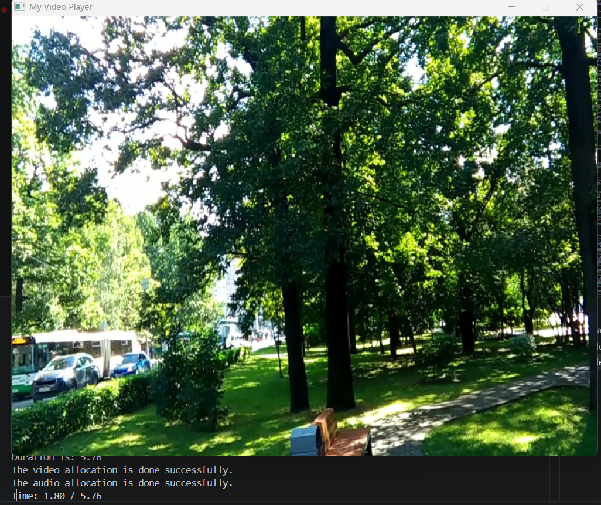

# FFmpeg SDL2 Video Player

A media player written in C using FFmpeg and SDL2.
## Screenshot

## Features

- MP4 playback
- H264 video decoding
- AAC audio decoding
- Audio playback using SDL2
- Pause / Resume
- Seeking
- Playback speed control

## Controls

Space - Pause / Resume

Right Arrow - Seek Forward
Left Arrow - Seek Backward

1 - 0.5x Speed

2 - 1x Speed

3 - 2x Speed

Esc - Exit

## Technologies Used

- C
- FFmpeg
- SDL2
=======
# ffmpeg-sdl2-video-player-c
A media player written in C using FFmpeg and SDL2 supporting MP4 playback, audio/video decoding, seeking, pause/resume and playback speed control.

